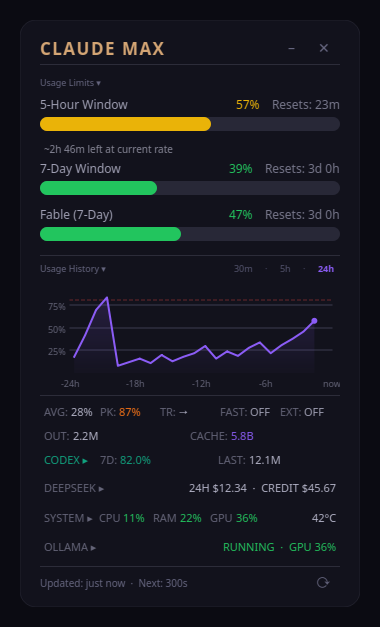

# Claude Indicator

A translucent Linux desktop widget combining Claude and Codex usage, DeepSeek
API cost/credit, local system activity, and Ollama/GPU/ComfyUI status in one
panel.




## Features

- **Real-time usage tracking** — monitors 5-hour and 7-day rate limit windows
- **Model-specific limits** — shows Opus or Sonnet 7-day utilization when available
- **Codex limit percentage** — reads current limits through local `codex app-server`, renders whichever one or two windows are present, and combines them with latest-thread and lifetime totals from local Codex state
- **DeepSeek spend and credit** — shows OpenCode-recorded DeepSeek cost from the rolling past 24 hours plus current account credit from DeepSeek's official balance endpoint
- **Embedded Ollama section** — compact Ollama summary that expands to show loaded models, NVIDIA GPU/VRAM, ComfyUI queue state, and locally configured Ollama task loops
- **Compact system activity** — shows CPU, RAM, GPU, and download/upload byte rates for the active lowest-metric UP IPv4 default-route interface(s); route or counter changes reset the 3-second sample baseline instead of producing a spike
- **Expandable Cron Manager** — reads the current user's crontab and journal entries, lists each job, and shows live status (`ok`, `late`, `unknown`) with last run + next scheduled run
- **Smart TODO command center** — captures an overall inbox task and ranks TODOs from local workspaces from the tray
- **Compact terminal selector** — a 320px docked panel groups live Claude/Codex/OpenCode tabs by status, keeps notes and park state, and selects duplicate-project GNOME Terminal tabs by their exact TTY instead of cycling by title; other emulators use best-effort verified title/key navigation
- **Docked drag and recoverable minimize** — drag either the main widget or the selector header/background to move them together; minimizing hides the main usage panel but leaves the terminal selector and right-edge restore sliver usable, while tray hide hides every surface
- **Color-coded progress bars** — green/yellow/orange/red based on usage percentage
- **Live countdown timers** — shows time remaining until each window resets
- **Always-on-top translucent widget** — frameless, draggable, stays visible over other windows
- **Auto-refresh** — polls the API every 5 minutes, countdowns update every second
- **OAuth token management** — reads credentials from Claude Code and handles token refresh automatically

## Screenshot

The widget displays a dark translucent overlay with:
- "CLAUDE MAX" header in warm gold
- Up to 3 progress bars (5-Hour Window, 7-Day Window, Model-specific 7-Day)
- A compact `CODEX` row with current Codex limit percentage and local usage totals
- A compact `DEEPSEEK` row with `24H` spend and `CREDIT` always visible
- A collapsed `OLLAMA` row with GPU summary and expandable details
- A compact `SYSTEM` row with CPU/RAM/GPU and IPv4 default-route download/upload rates; expand it for temperature and an explicit `NET` row
- `CRON JOBS` row that collapses to one line and expands to show per-job status and timing
- A compact `TABS` row that opens the docked terminal-session selector
- Percentage and reset countdown on each bar
- Last-updated timestamp and manual refresh button

## Cron Manager behavior

- **What appears**: one collapsed row labeled `CRON JOBS` with a late-job count summary
- **Expand**: click the row to expand a compact list of user cron jobs
- **Job status meanings**:
  - `ok` — matched a recent journal execution for the expected previous schedule slot (with 180s grace)
  - `late` — cron job is overdue relative to the expected next/previous run window within the available journal history
  - `unknown` — no reliable evidence in the collected 48h journal window
- **Per job fields**: label (from inline/full-line comments or fallback to command), schedule, last run age (`just now`, `Xm ago`, `Xh ago`, `Xd ago`), and next run estimate for common 5-field cron patterns
- **Data source**: `crontab -l` for job definitions and `journalctl _COMM=cron` for command execution history
- **Refresh interval**: every 5 minutes

## Smart TODO command center

Open the tray menu and select **Smart TODOs…**. The modeless command center is
created on first use and reused after that, so the main Indicator can stay visible
or hidden independently.

### Capture and completion

- Enter a task, optionally clear **No due date** and choose a date, then select
  **Add task**.
- Captured tasks are written only to the `Indicator Inbox` section of
  `~/TODO.md`, between `<!-- claude-indicator:inbox:start -->` and
  `<!-- claude-indicator:inbox:end -->`. The Indicator owns only that marked
  section and preserves the rest of the file.
- Only open tasks inside the single valid managed section in the exact injected
  home TODO have a **Complete** control. Matching Indicator IDs in project TODOs
  or elsewhere in the home file are ignored.
- **Dismiss** means finished in the command center, not Markdown completion. It
  never edits a TODO source file and is available for every active task,
  including read-only project TODO entries. Dismissed keys are stored locally in
  `~/.claude/smart_todos_finished.json`; malformed state stays visible as a
  warning and leaves tasks active.
- **Restore** appears in the **Finished** view. It removes only the local finished
  marker and does not edit or reopen the source Markdown checkbox.
- **Open source** opens the selected file at its Markdown line when `code`,
  `codium`, or `gedit` is available, and otherwise opens the file with
  `xdg-open`. No shell command is constructed.

### Views and ranking

- **Today** is the default. It shows pinned actionable tasks first, then fills
  the docket from the existing rank order to seven items. If more than seven
  active tasks are pinned, every pin remains visible. Only Today rows carry the
  functional `01`–`07` execution-order numbering; **Reset** returns to Today
  across all projects.
- The remaining views are **Focus**, **All open**, **Waiting**, **Snoozed**,
  **New / changed**, **Duplicates**, **Projects**, **Stale 30+**,
  **Stale 60+**, **Stale 90+**, **Completed inbox**, and **Finished**. Focus is
  actionable work; All open also includes waiting and snoozed work.
- **New / changed** reports only differences from the immediately previous
  successful scan and adds mint status metadata without changing task rank.
  **Duplicates** uses exact case-folded task copy with collapsed whitespace,
  keeps every source row contiguous, and labels each `copy N of M`. It never
  bulk-mutates a group; each action targets one stable source identity.
- **Projects** shows one summary per project with active, focus, waiting,
  snoozed, overdue, new/changed, duplicate, and stale counts plus its top task.
  Select a summary to reuse the top task's Why Now explanation, then choose
  **Open queue** to set that project filter and enter Focus.
- **Stale 30+**, **Stale 60+**, and **Stale 90+** contain undated actionable
  tasks only. Age is conservative: the first observation starts at the source
  file modification date, then later successful scans maintain task-specific
  unchanged dates.
- Waiting recognition includes `blocked by owner`, `blocked-by-owner`, and
  future `on or after`, `no earlier than`, `only after`, or `until` dates.
- Search covers task text, project, heading, tags, and ranking reasons. The
  project filter narrows results to one discovered project.
- Ranking is explainable in the **Why now** rail. Signals include explicit due
  dates, P0/P1 and urgent language, revenue or customer impact, billing or cost
  exposure, production verification work, and overall-inbox capture. Explicit
  waits and future `on or after` / `no earlier than` gates remain outside Focus
  until actionable.

### Daily workflow actions and state

- **Pin today** / **Unpin** controls explicit Today membership.
- **Snooze…** accepts Tomorrow, Next week, or an exact future date. A task wakes
  at the start of its stored date (`today >= until`); **Wake now** removes a
  future snooze immediately.
- **Copy context** places plain task, project, absolute source/line, heading,
  due date, urgency, score, and Why Now text on the desktop clipboard. The task
  copy is data only and is never executed.
- Finished keys stay in `~/.claude/smart_todos_finished.json`. Pins, snoozes,
  and content-free scan observations stay separately in
  `~/.claude/smart_todos_workflow.json`. Both stores are strict local JSON with
  safe atomic replacement; persistence failure is shown inline and does not
  project a successful action into the UI.

### Local data boundary

The scanner reads `~/TODO.md` plus `TODO.md` files at bounded depth under
`~/claude-workspace` and `~/codex_workspace`. It skips hidden, dependency,
build, cache, coverage, test-output, nested worktree, and symlink directories,
caps the rendered result set, and reports unavailable roots, unreadable or
oversized files, symlink TODO files, and special files in the dialog. Workspace
candidates remain confined beneath their resolved configured root.
All scanning, ranking, filtering, persistence, and source navigation stay on
this computer. Smart TODOs adds no API calls, hosted service, subscription, or
billable usage. It adds no notification, email, cloud synchronization, or
public endpoint.

## DeepSeek accounting boundary

The `24H` amount is the sum of numeric `message.data.cost` values for DeepSeek
assistant messages recorded in the local OpenCode database during the rolling
past 24 hours. Its tooltip reports ledger coverage and limits the claim to
OpenCode-recorded traffic; calls made by other clients are not included. The
database is opened read-only, and message content is never selected or shown.

`CREDIT` comes from `GET https://api.deepseek.com/user/balance`. Successful
reads append only timestamped currency balances to
`~/.claude/deepseek_balance_history.json` with mode-`0600` atomic replacement.
If the local cost ledger is unavailable, observed balance decreases provide a
clearly marked estimate. Top-ups are not counted as spend, currencies are never
combined, partial coverage is disclosed, and cached credit is marked `LAST`.
Cached credit is hidden after 15 minutes; while visible, its age is shown in the
expanded row and tooltip.

To keep the 340px panel usable on shorter screens, **Usage History** and
**Ollama** are mutually exclusive expandable sections. Opening either one
collapses the other; the compact DeepSeek details remain independently usable.
After any content-size change, the window is repositioned as needed so its full
frame remains inside the primary screen's available work area.

## Prerequisites

- **Claude Code Max subscription** — the widget reads usage data from Anthropic's API
- **Claude Code CLI** — must be installed and logged in (the widget reads OAuth credentials from `~/.claude/.credentials.json`)
- **Codex CLI** — `codex` must be installed, on `PATH`, and logged in so local `codex app-server` can read the account rate limits
- **DeepSeek API key** — set `DEEPSEEK_API_KEY`, or use OpenCode's existing
  `~/.local/share/opencode/auth.json`; the fallback must be an owner-controlled,
  non-symlink regular file with mode `0600`
- **Ollama** at `127.0.0.1:11434` and **ComfyUI** at `127.0.0.1:8188` are optional
- **Python 3.10+**
- **Linux with X11 or Wayland** (tested on Ubuntu/GNOME)

## Installation

```bash
git clone https://github.com/yourusername/claude-indicator.git
cd claude-indicator
pip install -r requirements.txt
```

### Dependencies

- `PySide6` >= 6.6.0 — Qt6 bindings for the desktop widget
- `requests` >= 2.31.0 — HTTP client for API calls
- Installed and logged-in `codex` CLI — supplies the local app-server rate-limit protocol

## Usage

```bash
python claude_widget.py
```

The widget appears in the top-right corner of your primary screen. Drag the main
widget or the open terminal selector's header/background to reposition the
docked pair. Click the **X** to close or **⟳** to force a refresh.

### Autostart on Login

To launch the widget automatically on login, create `~/.config/autostart/claude-widget.desktop`:

```ini
[Desktop Entry]
Type=Application
Name=Claude Usage Widget
Exec=/path/to/python3 /path/to/claude_widget.py
Hidden=false
NoDisplay=false
X-GNOME-Autostart-enabled=true
```

> **Note**: If using conda/miniconda, use the full Python path (e.g., `/home/user/miniconda3/bin/python3`) since `~/.bashrc` is not sourced by autostart.

### Troubleshooting

If you see an error about `xcb-cursor`, set the library path before running:

```bash
LD_LIBRARY_PATH=/path/to/miniconda3/lib python claude_widget.py
```

## How It Works

1. **Reads OAuth credentials** from `~/.claude/.credentials.json` (written by Claude Code CLI)
2. **Refreshes the access token** if it's within 5 minutes of expiry, using the OAuth refresh flow
3. **Fetches usage data** from `GET https://api.anthropic.com/api/oauth/usage` with the `anthropic-beta: oauth-2025-04-20` header
4. **Reads Codex usage** from local `codex app-server` (`account/rateLimits/read`) plus `~/.codex/state_*.sqlite`; cached session `token_count` events under `~/.codex/sessions/` are visibly marked fallbacks and are accepted only when no more than five minutes old and not past their reset
5. **Builds cron health** from `crontab -l` plus `journalctl` execution logs, using command equality and local-time schedule prediction
6. **Scans local TODO files** on a background Qt worker and writes only the marked Indicator Inbox section in `~/TODO.md`
7. **Samples system activity** from `/proc`, selecting the active lowest-metric UP IPv4 default-route interface(s) for network byte rates without summing unrelated virtual interfaces
8. **Renders the widget** using PySide6 with custom-painted progress bars, translucent panels, collapsible custom rows, and a modeless Smart TODO dialog

### Architecture

The application uses `claude_widget.py` for the Indicator and `smart_todos.py`
for the local TODO domain and dialog, with these components:

| Component | Description |
|---|---|
| `ClaudeUsageClient` | Handles OAuth credential reading, token refresh, and API calls |
| `FetchWorker` | QThread that fetches usage data off the main thread |
| `UsageBar` | Custom-painted widget for a single progress bar with label, percentage, and countdown |
| `CodexUsageRow` | Custom-painted summary row backed by live local app-server limits plus local Codex SQLite totals |
| `DeepSeekUsageRow` | Rolling local OpenCode cost plus official current DeepSeek credit, with source disclosure |
| `LocalAISection` | Compact expandable Ollama models, GPU/VRAM, ComfyUI, and local task-loop status |
| `SystemMetricsReader`, `SystemMetricsRow` | Three-second CPU/RAM/GPU summary plus monotonic receive/transmit rates for the active lowest-metric UP IPv4 default route(s), read directly from procfs |
| `CronJobsWidget` | Collapsible row showing per-job cron health, last run age, and next run estimate |
| `CronJobsFetchWorker`, `CronJobInfo` | Background worker and model used to parse crontab + journal history |
| `Cron parsing helpers` | Parsers for `crontab -l`, schedule matching, and journal matching |
| `ClaudeWidget` | Main frameless, translucent, always-on-top widget with drag and tray support |
| `SmartTodoDialog`, `TodoScanWorker` | Modeless command center and background local TODO scanner from `smart_todos.py` |
| `UsageData` / `UsageEntry` | Dataclasses modeling the API response |

### Color Thresholds

| Usage | Color |
|---|---|
| 0–49% | Green |
| 50–74% | Yellow |
| 75–89% | Orange |
| 90–100% | Red |

## License

MIT
